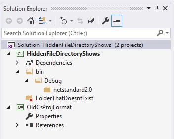

This repository demonstrates an issue with how Visual Studio shows the new `csproj` format in the solution explorer. It corresponds to [dotnet/project-system#3931](https://github.com/dotnet/project-system/issues/3931).

The issue described in this document was tested against Visual Studio 15.8.2 (which is the latest stable release at the time of writing.)

<!-- TOC -->

- [Project Overview](#project-overview)
    - [`HiddenFileDirectoryShows`](#hiddenfiledirectoryshows)
    - [`OldCsProjFormat`](#oldcsprojformat)
- [Actual Behavior](#actual-behavior)
- [Expected behavior](#expected-behavior)

<!-- /TOC -->

# Project Overview

## `HiddenFileDirectoryShows`

This project is created with the new `csproj` infrastructure and contains two hidden files:

```xml
<ItemGroup>
  <None Include="$(OutputPath)\$(AssemblyName).dll" Visible="false" />
  <None Include="FolderThatDoesntExist\FileThatDoesntExist.txt" Visible="false" />
</ItemGroup>
```

## `OldCsProjFormat`

This project is created with the old `csproj` infrastructure and also contains two hidden files using the same `<ItemGroup>` listed above.

# Actual Behavior

For `HiddenFileDirectoryShows` (the new `csproj` project), the directories leading up to the hidden files are shown in the solution explorer.



# Expected behavior

The directories should not be shown for `HiddenFileDirectoryShows`, which is the same behavior as `OldCsProjFormat`.
